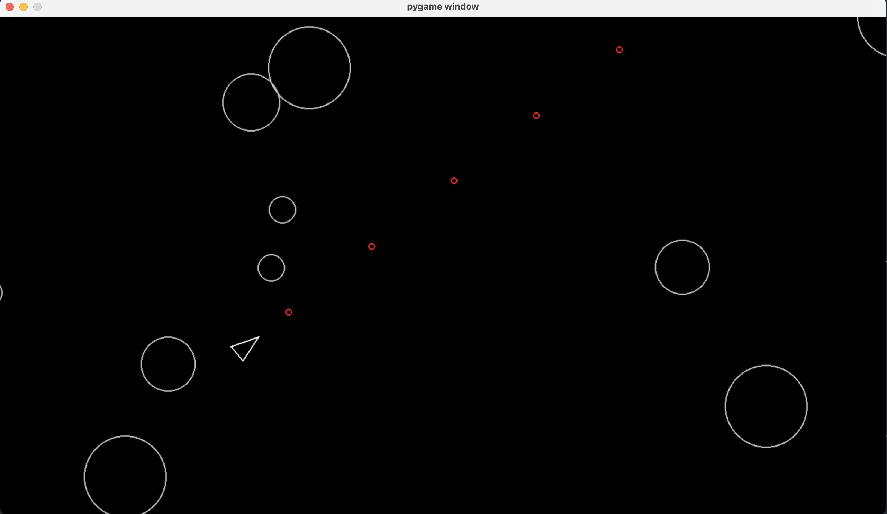

# 🪐 Asteroids – A Classic Arcade Game in Python with Pygame

A simple clone of the classic *Asteroids* arcade game, built in Python using the Pygame library. Pilot your spaceship through an asteroid field, avoid collisions, and shoot down asteroids to survive!

 <!-- You can replace this with an actual image file later -->

---

## 🚀 Features

- Smooth player controls with rotation
- Generated asteroid field
- Asteroids split into smaller fragments when hit
- Collision detection between player, asteroids, and shots
- Clean object-oriented code structure using Pygame’s `Sprite` groups

---

## 🛠️ Requirements

- Python 3.7+
- Pygame 2.6.1

You can install the required dependencies using:

```zsh
pip install -r requirements.txt
